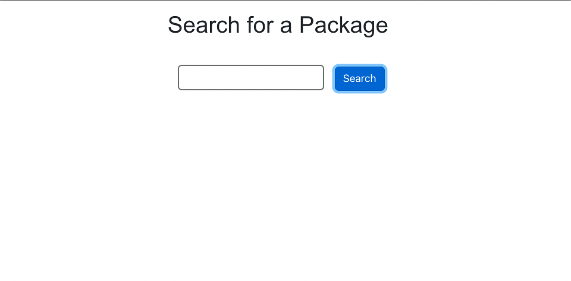
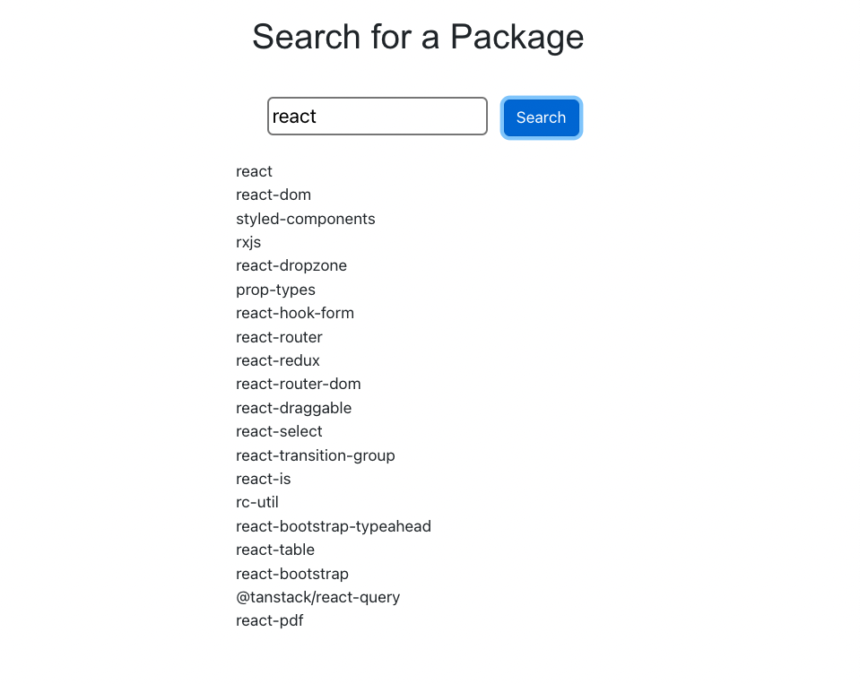

# NPM Package Search
This project was created as a way to apply learnings from a React / Typescript Udemy course. As one of the earlier projects in the course, its purpose is to help explain how redux is used in React projects but also how the use of Typescript affects a standard redux implementation.

Tech used: TypeScript, React, Redux, Thunk.

## Table of Contents
- [Installation](#installation)
- [Usage](#usage)

## Installation

1. Clone the repository:

        git clone https://github.com/BeanDeebe/redux-typescript-project.git

2. Navigate to project directory:
        
        cd redux-typescript-project
    
3. Install dependencies:

        npm install

4. Run the project:

        npm start

## Usage

Simply type a name of a NPM package into the search bar, and a list will return with all NPM packages that contain that search string.

### Page seen upon first load:

### After searching for "react":
